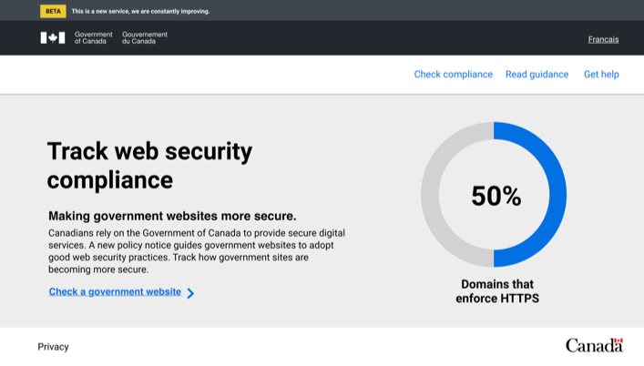
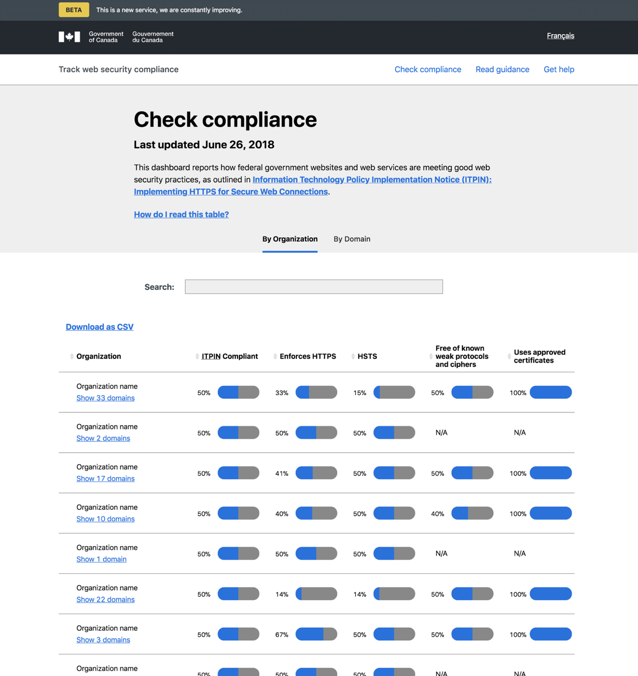

## Web

This is the web service portion of _Track web security compliance_. This application displays the results of the scanner so that Government of Canada service owners know if they are meeting good web security practices, as outlined in [Information Technology Policy Implementation Notice (ITPIN): Implementing HTTPS for Secure Web Connections](https://www.canada.ca/en/treasury-board-secretariat/services/information-technology/policy-implementation-notices.html).

This is what it looks like with demo data:

|         | 
|---------|
|  |  
| | 

## Development Setup

For development purposes it is recommended that you install [MongoDB](https://www.mongodb.com/) and run the database locally.

This application is a [Flask](http://flask.pocoo.org/) app and currently works with Python 3.6. We recommend [pyenv](https://github.com/yyuu/pyenv) and [pipenv](https://pipenv.kennethreitz.org/en/latest/) for easy Python version and dependency management.

```bash
# install dependencies and include dev dependencies as well
pipenv install -d
# start the application
pipenv run start
```

